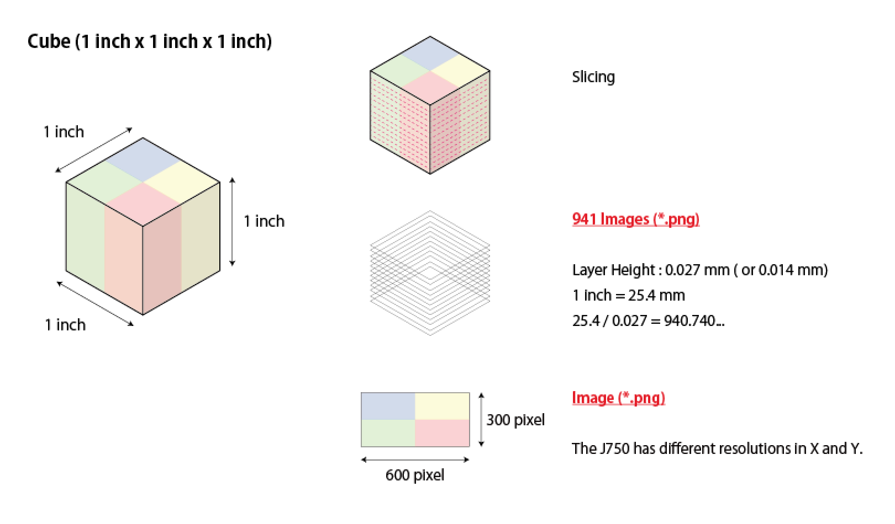

# Stratasys_J750  

Update 200405  

データ入稿について要確認。  

[https://help.grabcad.com/article/230-guide-to-voxel-printing?locale=ja&fbclid=IwAR3PvdP71KfqY1herjNa87oGvXnszbsXIcaNfOUYNfbDLn_kIZydNeyYXes](https://help.grabcad.com/article/230-guide-to-voxel-printing?locale=ja&fbclid=IwAR3PvdP71KfqY1herjNa87oGvXnszbsXIcaNfOUYNfbDLn_kIZydNeyYXes)  

マテリアルリスト。  
上の資料のテーブルから値取るのがめんどうなので、色の見本と合わせてプライベート用のサーバ上に置いておく。  

[https://html.naysok.org/stratsys_j750/](https://html.naysok.org/stratsys_j750/)  

---  

# 形、寸法について  

### Layer Height  

> 準備するスライスのレイヤーの厚さをプリントされたレイヤーの厚さに一致させることをお勧めします。プリンタのレイヤーの厚さは次のとおりです。  
> 0.014 mm = 高品質  
> 0.027 mm = 高速 & ��イミックス  
> スライスのプリント時に、スライスの厚さがプリンタのレイヤーの厚さと一致していない場合、プリンタはこの差を補正します。これにより、スライスの重複やスキップが発生する場合があります。たとえば、スライスの厚さを 0.0135 mm に設定し、プリンティングモードがハイミックスである場合、プリンタは、プリンタのレイヤーの厚さである 0.027 mm に達するまで、各イメージを 2 回プリントします。  
 

### XY 解像度  

> J750 は X と Y で解像度が異なります。  
> X 解像度 = 600 DPI  
> Y 解像度 = 300 DPI  
> したがって、パーツが 1 インチのキューブの場合、各スライスは 600x300 ピクセルのサイズになります。  

1インチ立法の箱については多分こう。  
この理解で正しければ、最後に 1:2 にスケール変更をかければ良さそう。  

  

---  

# 色、マテリアルについて  

### 色の割り当て  
> J750 での通常のカラー印刷では、パーツの色は任意です。たとえば、パーツが薄緑色の場合、GrabCAD Print は、必要な結果を得るために各スライス内のシアン、イエロー、ホワイトの最適な組み合わせを決定します。しかし、ボクセル印刷では、スライスを作成するので、スライス ソフトウェアは、使用可能な材料のみを使用して希望する色を作成する方法を決定する必要があります。  

### フォーマットのエクスポート  

> PNG を使用する方法では、各レイヤーに対して 1 つの PNG イメージ ファイルを使用します。  
> Voxel Print Utility は、ロードされた材料とイメージの色を一致させるため、各イメージ ファイルは 6 つの異なる色のみを使用するか、背景色に加えて高速モード用に 3 つを使用する必要があります。  
> 色の境界付近でディザリングが発生しないように注意してください。Voxel Print Utility で「色が多すぎます」というエラーが発生します。  
> PNG を使用する方法については、以下をお読みください。  

### GrabCAD Voxel ファイルを作成するPNG を使用する方法  

> PNG ファイルから GrabCAD ボクセルファイルを生成するには:  
> (1) GrabCAD Print を開いて、J750 プリンタを選択します。  
> (2) アプリメニューから、[Voxel Print Utility を起動する] を選択します。Voxel Print Utility が開きます。  
> (3) Slice file prefix (スライスファイルのプレフィックス)フィールドに、イメージファイルのプレフィックス (例: slice_) を入力します。このプレフィックスはすべてのイメージファイルに割り当てられます。  
> (4) 選択をクリックして、PNG ファイルを含むフォルダに移動します。  
> (5) PNG ファイルを含むフォルダを選択すると、フォルダと GCVF の出力ファイル名ボックスが入力されます。このテキストを編集することによって、GCVF ファイルの名前を変更できます。  
> (6) スライス範囲、スライス パラメータ、背景色のセクションの情報は自動的に入力されますが、情報を確認してください。たとえば、この例では、背景ピクセルは透明なので、A を 0 に変更する必要があります。  
> (7) 次へ をクリックします。*.gcvf ファイルの生成の進捗状況を示す進捗バーが表示されます。ファイルサイズによって、ファイル生成には数分かかることがあります。ファイル作成時にエラーが発生すると、この画面にエラーが表示されます。  
> *.gcvf ファイルの生成が完了すると、[Material Mapping (材料マッピング)] 画面が表示されます。右側の色は、Voxel Print Utility が PNG ファイルで特定した基本色です。PolyJet 3D プリンタを使って正確な色でプリントされるようにするには、右側の各色を適切な PolyJet モデル材料 (左側) に一致させる必要があります。たとえば、右側の青色は、VeroBlue または VeroCyan にマッピングできます。  
>(8) 材料列で、画面の右側に表示されている色に基づいて、使用する各 PolyJet モデル材料を選択します。  
> 注:プリントする前に、割り当てたモデル材料が材料キャビネットにロードされていることを確認してください。  
> (9) 材料列で、画面の右側に表示されている色に基づいて、使用する各 PolyJet モデル材料を選択します。  
> 注:プリントする前に、割り当てたモデル材料が材料キャビネットにロードされていることを確認してください。  
> (10) OK をクリックして、このメッセージを閉じます  
> (11) Voxel Print Utility を閉じます  

色々書いてあるが、必要なデータについて一部抜粋し、改行を追加し、確認する。  

オリジナル  

> PNG を使用する方法では、各レイヤーに対して 1 つの PNG イメージ ファイルを使用します。  
> Voxel Print Utility は、ロードされた材料とイメージの色を一致させるため、各イメージ ファイルは 6 つの異なる色のみを使用するか、背景色に加えて高速モード用に 3つを使用する必要があります。  

↓  

改行等を追加  

> PNG を使用する方法では、各レイヤーに対して 1 つの PNG イメージ ファイルを使用します。  
> Voxel Print Utility は、ロードされた材料とイメージの色を一致させるため、
> - 各イメージ ファイルは 6 つの異なる色のみを使用するか、
> - 背景色に加えて高速モード用に 3つを使用する必要があります。  

加えてこれ。  

> ボクセル印刷では、スライスを作成するので、スライス ソフトウェアは、使用可能な材料のみを使用して希望する色を作成する方法を決定する必要があります。  

つまり（？）、色付きのマテリアルの6色分をプリンタに装填し、その6色のマテリアルをボクセルレベルで並べる。  結果的に、視覚として混色されて、フルカラーに見える、という認識で良いのかな。  

これについて考えうる実装として、マスターの設計の画像から低解像度に落とす、低解像度な1ピクセルを NxN のピクセルの領域として、その各領域に配する CMYK の割合の計算し、ランダムにでも並べる。標準マテリアルに、透明 + CMYK があることは確認した。画像処理部分を書く。  

  

---  